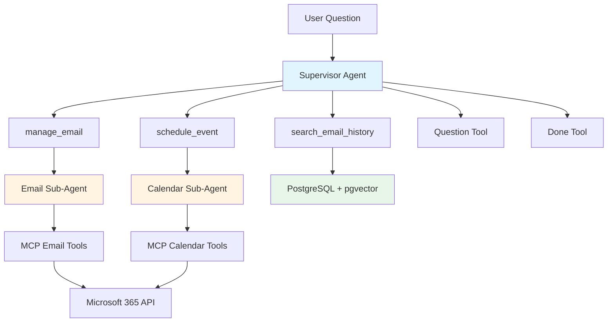
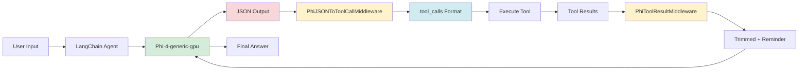
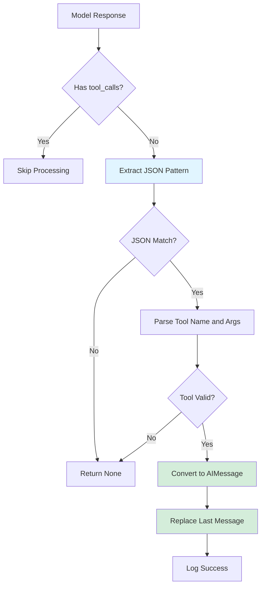
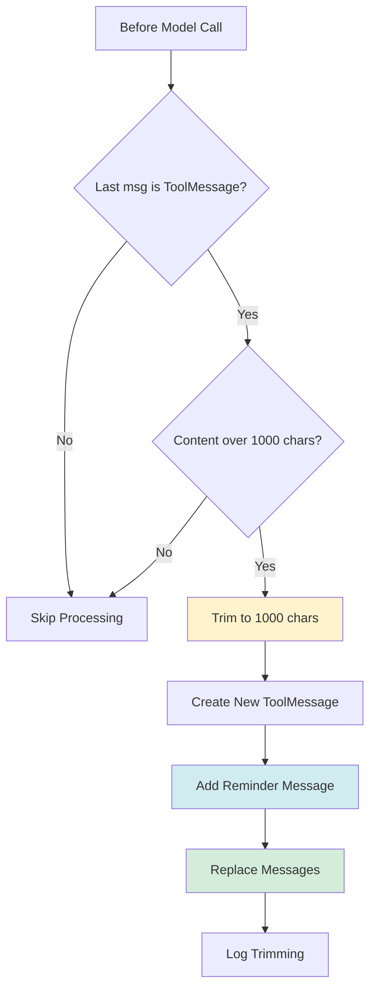
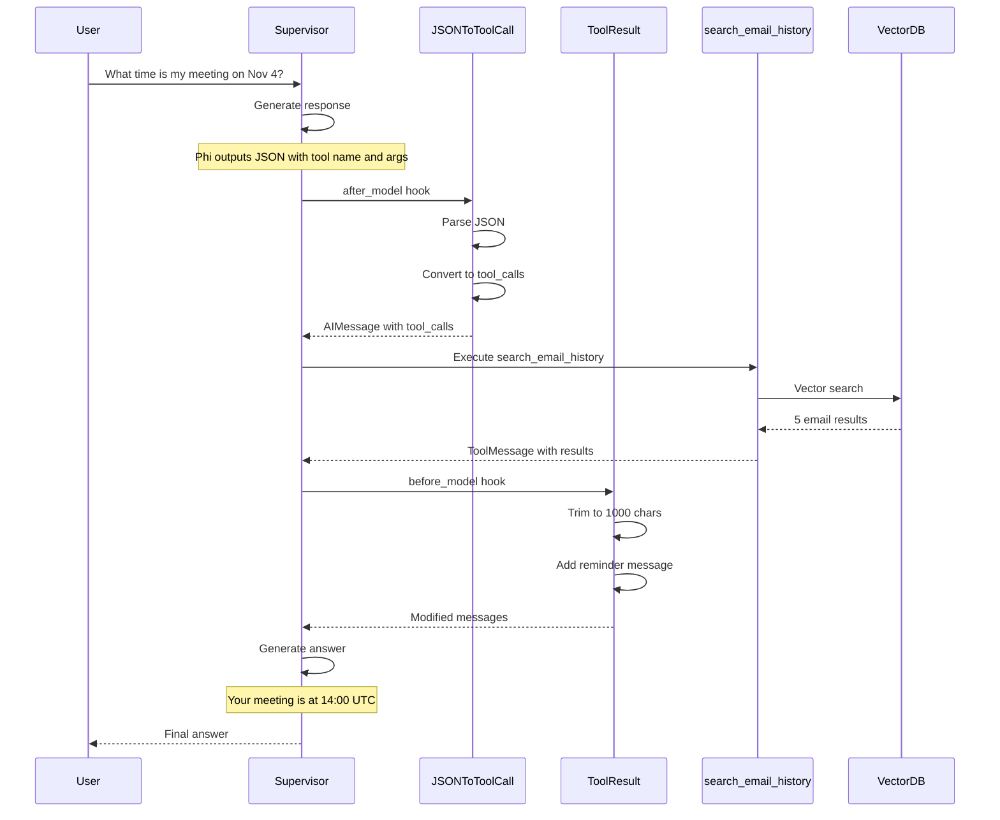
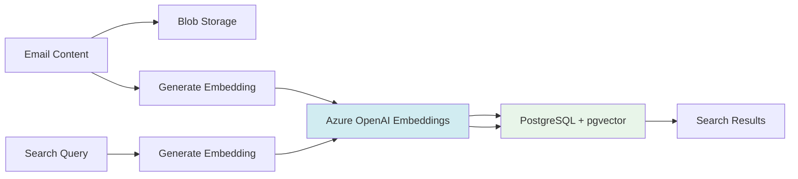
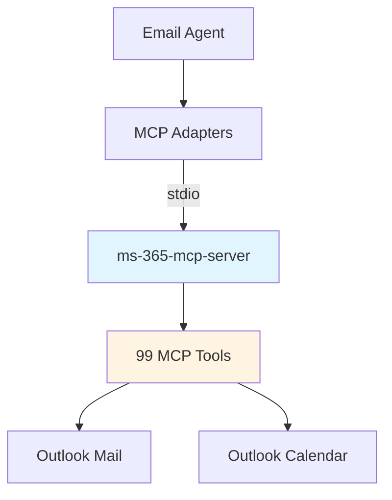

# Email Agent Architecture with Phi-4 Local Model

## System Overview

## Phi-4 Integration with Custom Middleware

## Middleware Details

### PhiJSONToToolCallMiddleware (after_model)

**Purpose**: Converts Phi's natural JSON output into LangChain's tool_calls format

**How it works**:
1. **Detects JSON**: Regex pattern `{"name": "tool_name", "args": {...}}`
2. **Validates**: Checks if tool exists in schema
3. **Converts**: Creates AIMessage with proper tool_calls structure
4. **Replaces**: Swaps text response with structured tool call

### PhiToolResultMiddleware (before_model)

**Purpose**: Prevents context overflow and prompts Phi to synthesize answers

**How it works**:
1. **Detects long results**: Checks if tool result > 1000 characters
2. **Trims intelligently**: Keeps first 1000 chars, notes trimmed amount
3. **Adds reminder**: Appends "Based on the tool results above, please answer the original question."
4. **Prevents empty responses**: Phi was returning empty content without this

## Component Breakdown

### Supervisor Agent
- **Model**: Phi-4-generic-gpu (Temperature: 0.0)
- **System Prompt**: `agent_system_prompt_local_model` with tool calling instructions
- **Tools**: High-level orchestration tools
  - `search_email_history`: Vector search in PostgreSQL
  - `manage_email`: Delegates to Email Sub-Agent
  - `schedule_event`: Delegates to Calendar Sub-Agent
  - `Question`: Human-in-the-loop for clarification
  - `Done`: Signals completion
- **Middleware**: Both custom middleware components

### Sub-Agents
Both use simpler prompts with JSON output instructions:

**Email Sub-Agent**:
- Tools: `list-mail-messages`, `create-draft-email`, `get-mail-message`, `send-mail`
- Middleware: `PhiJSONToToolCallMiddleware`

**Calendar Sub-Agent**:
- Tools: `list-calendar-events`, `create-calendar-event`, etc.
- Middleware: `PhiJSONToToolCallMiddleware`
- Special constraint: Always use `{"top": 10}` parameter

## Data Flow Example

## Key Innovations

1. **JSON-First Approach**: Leverage Phi's strength at generating JSON instead of fighting its tool calling limitations

2. **Middleware Pattern**: Use LangChain's middleware hooks to transform Phi's output at the right moments
   - `after_model`: Convert text to structured format
   - `before_model`: Trim context and add guidance

3. **Context Management**: Trim tool results to prevent overwhelming the 14B parameter model

4. **Hierarchical Architecture**: Supervisor delegates to specialized sub-agents, reducing complexity per agent

## Performance Characteristics

- **Model**: Phi-4-generic-gpu (8.37 GB)
- **Temperature**: 0.0 (maximum accuracy)
- **Endpoint**: Foundry Local on port 57389
- **Context Window**: Managed via trimming at 1000 characters
- **Tool Call Success Rate**: ~100% with middleware (was ~0% without)

## Storage Architecture

## MCP Integration

**Communication**: stdio (standard input/output)  
**Authentication**: Delegated to MCP server  
**Tools Loaded**: 99 (Email: 4, Calendar: 12, Auth: 3)

