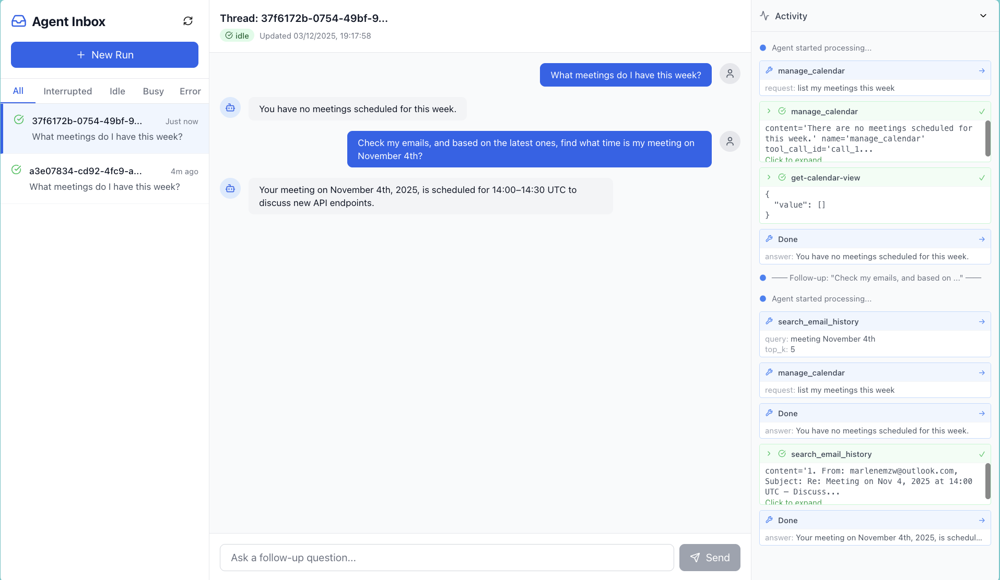

# Local Email Agent

An intelligent email assistant powered by Microsoft's Phi-4 local model, featuring a modern web UI, human-in-the-loop approvals, calendar integration, and Microsoft 365 connectivity via MCP (Model Context Protocol).



## Overview

This project demonstrates how to build a local email agent using:

- **Foundry Local** (runs entirely on your machine), this project shows phi-4 but you can use any model you like
- **PostgreSQL + pgvector** for semantic email search
- **Microsoft 365 MCP Server** for email/calendar operations
- **LangGraph** for agent orchestration with Human-in-the-Loop (HITL) approvals
- **FastAPI Backend** with SSE streaming for real-time updates
- **Next.js Frontend** - Agent Inbox UI for managing conversations and approvals

## 🌱 Quick Start

### Prerequisites

1. **Python 3.11+**
2. **Docker** (for PostgreSQL)
3. **Node.js 18+** (for MCP server and frontend)

### Setup

**1. Install Foundry Local:**

Windows:
```bash
winget install Microsoft.FoundryLocal
```

MacOS:
```bash
brew install microsoft/foundrylocal/foundrylocal
```

> Note: Foundry Local doesn't currently support Linux

**2. Install Dependencies:**

```bash
# Create virtual environment
python3 -m venv venv
source venv/bin/activate  # On Windows: venv\Scripts\activate

# Install Python packages
pip install -r email_agent/requirements.txt

# Install Microsoft 365 MCP Server
npm install -g @softeria/ms-365-mcp-server

# Login to the M365 account you want to use
npx @softeria/ms-365-mcp-server --login

# Install frontend dependencies
cd email_agent/frontend
npm install
cd ../..
```

**3. Start PostgreSQL + pgvector:**

```bash
# Start Docker container
docker compose up -d

# Wait ~10 seconds for PostgreSQL to initialize

# Enable pgvector extension
docker exec -it email-postgres psql -U postgres -d emaildb -c "CREATE EXTENSION IF NOT EXISTS vector;"

# Verify
docker exec -it email-postgres psql -U postgres -d emaildb -c "\dx"
```

If successful, you should see the `vector` extension listed:

```bash
  Name   | Version |   Schema   |                        Description
---------+---------+------------+-----------------------------------------------------------
 plpgsql | 1.0     | pg_catalog | PL/pgSQL procedural language
 vector  | 0.5.0   | public     | vector data type and ivfflat and hnsw access methods
```

**4. Configure Environment:**

```bash
# Copy local env template
cp email_agent/.env.local.example email_agent/.env
```

Edit the `.env` file and add your Azure OpenAI credentials:

```bash
AZURE_OPENAI_ENDPOINT=https://your-endpoint.openai.azure.com/
AZURE_OPENAI_API_KEY=your-api-key
AZURE_OPENAI_EMBEDDING_DEPLOYMENT=text-embedding-ada-002
```

**5. Import Your Emails** (Optional)

```bash
# Import last 3 months of emails from Outlook
python3 -m email_agent.import_emails --months 3 --batch-size 50 --storage local
```

**6. Run the Agent:**

Start both the backend and frontend:

```bash
# Terminal 1: Start the FastAPI backend
source venv/bin/activate
python -m email_agent.api

# Terminal 2: Start the Next.js frontend
cd email_agent/frontend
npm run dev
```

Then open [http://localhost:3000](http://localhost:3000) in your browser.

## 🎯 Features

### Agent Inbox UI

- **Thread-based conversations** - Each agent run creates a thread you can continue with follow-up questions
- **Real-time activity panel** - See tool calls and results as they happen via SSE streaming
- **Human-in-the-loop approvals** - Approve, edit, or reject sensitive actions like sending emails
- **Multiple concurrent runs** - Start new agent runs without waiting for others to complete

### Intelligent Email & Calendar Management

- **Semantic email search** - Find emails based on meaning, not just keywords
- **Calendar integration** - List events, check availability, create/update/delete events
- **Email operations** - Send emails, create drafts, list inbox messages
- **Context-aware responses** - The agent uses conversation history for follow-up questions

### Human-in-the-Loop (HITL)

The agent requires human approval for sensitive actions:
- Sending emails
- Creating/updating calendar events
- Questions requiring user clarification

## 🏗️ Architecture

### Sub-Agent Architecture

The agent uses a supervisor pattern with specialized sub-agents:

```
┌─────────────────────────────────────────────────────────────────┐
│                        Supervisor Agent                          │
│   (Routes requests to appropriate sub-agent or tool)            │
└───────────────┬─────────────────┬─────────────────┬─────────────┘
                │                 │                 │
        ┌───────▼───────┐ ┌───────▼───────┐ ┌───────▼───────┐
        │ Calendar      │ │ Email         │ │ Search        │
        │ Sub-Agent     │ │ Sub-Agent     │ │ Email History │
        │               │ │               │ │               │
        │ MCP Tools:    │ │ MCP Tools:    │ │ Vector Store  │
        │ • get-calendar│ │ • send-mail   │ │ (pgvector)    │
        │ • create-event│ │ • create-draft│ │               │
        │ • update-event│ │ • list-mail   │ │               │
        └───────────────┘ └───────────────┘ └───────────────┘
```

### Phi-4 Structured Output

Since Phi-4 doesn't have native tool calling, this project uses LangChain's `with_structured_output(method='json_mode')` to force valid JSON responses for reliable tool selection.

## 📊 How It Works

### Email Import & Storage

1. **Fetch from Outlook** via MCP Server (`@softeria/ms-365-mcp-server`)
2. **Generate embeddings** using Azure OpenAI (text-embedding-ada-002, 1536 dims)
3. **Store in PostgreSQL** with pgvector for semantic search
4. **Save email blobs** in `data/local_email_storage/`

### Agent Flow

1. User asks: *"Send an email to marlene@example.com about the meeting"*
2. **Supervisor** selects the `manage_email` sub-agent
3. **Email Sub-Agent** determines to use `send-mail` MCP tool
4. **HITL Interrupt** - User sees the email and can approve/edit/reject
5. After approval, email is sent and user sees confirmation

## 🛠️ Key Components

| File | Purpose |
|------|---------|
| `agent_graph.py` | LangGraph agent with supervisor and sub-agents, HITL interrupts |
| `api.py` | FastAPI backend with REST endpoints and SSE streaming |
| `foundry_service.py` | Foundry Local singleton for persistent LLM connection |
| `hitl_schemas.py` | Human-in-the-loop interrupt and response schemas |
| `email_storage.py` | PostgreSQL + pgvector integration for semantic search |
| `frontend/` | Next.js Agent Inbox UI with real-time streaming |

## 🐛 Troubleshooting

### PostgreSQL Port Conflict

If you see `FATAL: role postgres does not exist`:

```bash
# Stop local PostgreSQL
brew services stop postgresql@14

# Restart Docker container
docker compose restart
```

### Foundry Local Not Running

Ensure Foundry Local service is running:

```bash
curl http://127.0.0.1:63911/foundry/list
# Should return list of loaded models
```

### MCP Server Authentication

If email/calendar tools fail:

```bash
# Re-authenticate with Microsoft 365
npx @softeria/ms-365-mcp-server --login
```

### Frontend Not Connecting

If the frontend shows connection errors:

1. Ensure the backend is running on port 8000
2. Check the browser console for CORS errors
3. Verify `next.config.ts` has the correct proxy settings

## 📚 Additional Resources

- [ARCHITECTURE.md](ARCHITECTURE.md) - Detailed system design with Mermaid diagrams
- [Foundry Local Docs](https://github.com/microsoft/vscode-ai-toolkit)
- [LangGraph Documentation](https://langchain-ai.github.io/langgraph/)
- [Microsoft 365 MCP Server](https://github.com/softeria-cloud/ms-365-mcp-server)

---
