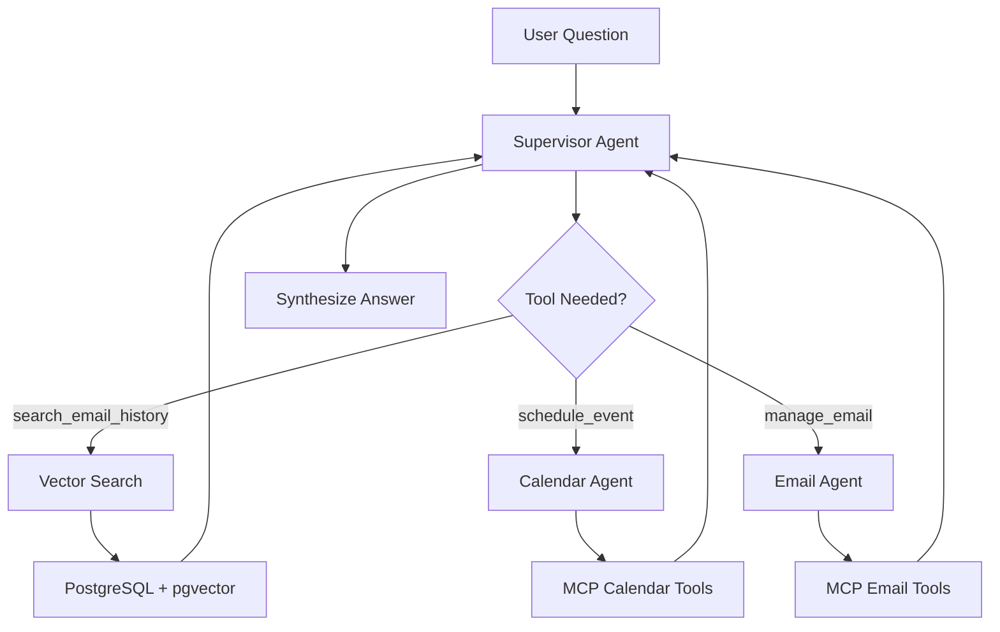

# Local Email Agent with Phi-4

An intelligent email assistant powered by Microsoft's Phi-4 local model, featuring vector-based email search, calendar integration, and Microsoft 365 connectivity via MCP (Model Context Protocol).

## 🎯 Overview

This project demonstrates how to build a production-ready email agent using:

- **Phi-4** via Foundry Local (runs on your machine)
- **PostgreSQL + pgvector** for semantic email search
- **Microsoft 365 MCP Server** for email/calendar operations
- **LangGraph** for agent orchestration with custom middleware
- **Local or cloud storage** for emails and embeddings

## 📁 Project Structure

```
msft/
├── email_agent/
│   ├── msft_email_agent_local.py    # Main agent (Phi-4 + MCP + PostgreSQL)
│   ├── test_phi4_agent.py           # Test agent (fake data, no setup)
│   ├── email_storage.py             # Email storage & vector search
│   ├── import_emails.py             # Import emails from Outlook
│   ├── view_emails_in_vector_store.py # Verify imported emails
│   ├── prompts.py                   # System prompts
│   ├── schemas.py                   # Pydantic schemas
│   ├── utils.py                     # Helper functions
│   ├── tools/                       # Custom tools
│   └── test_data/                   # Fake data for testing
│       ├── emails.json
│       └── calendar.json
├── data/
│   └── local_email_storage/         # Imported email blobs (gitignored)
├── docker-compose.yml               # PostgreSQL + pgvector setup
├── ARCHITECTURE.md                  # System design & diagrams
├── requirements.txt                 # Python dependencies
└── .env.local.example              # Environment template
```

## Quick Start

### Prerequisites

1. **Python 3.11+**
2. **Docker** (for PostgreSQL)
3. **Foundry Local**
4. **Node.js** (for MCP server)

### Setup

**1. Install Foundry Local:**

Windows: Install Foundry Local for your architecture (x64 or arm64):

```bash
  winget install Microsoft.FoundryLocal
```

MacOS: Open a terminal and run the following command:

```bash
brew install microsoft/foundrylocal/foundrylocal
```

Alternatively, you can download the installers from the releases page and follow the on-screen installation instructions.

> Note: Foundry Local doesn't currently support Linux

**2. Install Dependencies:**

```bash
# Create virtual environment
python3 -m venv venv
source venv/bin/activate  # On Windows: venv\Scripts\activate

# Install Python packages
pip install -r email_agent/requirements.txt

# Install Microsoft 365 MCP Server
npm install -g @softeria/ms-365-mcp-server

# login to the m365 account you want to use
npx @softeria/ms-365-mcp-server --login
```

**3. Start PostgreSQL + pgvector:**

```bash
# Start Docker container
docker compose up -d

# Wait ~10 seconds for PostgreSQL to initialize

# Enable pgvector extension
docker exec -it email-postgres psql -U postgres -d emaildb -c "CREATE EXTENSION IF NOT EXISTS vector;"

# Verify (exit by typing 'wq')
docker exec -it email-postgres psql -U postgres -d emaildb -c "\dx"
```

If successful, the command to verify displays a list of PostgreSQL extensions installed in the emaildb database. The output should look something like this:

```bash
  Name   | Version |   Schema   |                        Description
---------+---------+------------+-----------------------------------------------------------
 plpgsql | 1.0     | pg_catalog | PL/pgSQL procedural language
 vector  | 0.5.0   | public     | vector data type and ivfflat and hnsw access methods
(2 rows)
```

The key extension you're looking for is vector - this is the pgvector extension that enables:

- The vector data type for storing embeddings
- Vector similarity search operations (cosine distance, L2 distance, etc.)
- HNSW and IVFFlat indexing for fast nearest neighbor searches

**4. Configure Environment:**

```bash
# Copy local env template
cp email_agent/.env.local.example email_agent/.env
```

Edit the new `.env` in the [email_agent](/email_agent/) folder and add your Azure OpenAI credentials, specifically your:

```bash
- AZURE_OPENAI_ENDPOINT #(this project uses the openai v1 api)
- AZURE_OPENAI_API_KEY  #(We encourage you to use Entra ID)
- AZURE_OPENAI_EMBEDDING_DEPLOYMENT (e.g., text-embedding-ada-002)
```

**4. Start Foundry Local:**

```bash
# In Foundry Local UI, load the Phi-4-generic-gpu model
# Ensure it's running on http://127.0.0.1:63911
```

**5. Import Your Emails** (Optional)

```bash
# Import last 3 months of emails from Outlook
python3 -m email_agent.import_emails --months 3 --batch-size 50 --storage local

# Verify import
python3 -m email_agent.view_emails_in_vector_store
```

**6. Run the Agent:**

```bash
python3 -m email_agent.msft_email_agent_local
```

## 🧪 Testing Without Setup

Want to test Phi-4's function calling without PostgreSQL or email import?

```bash
# Run the test agent (uses fake data from test_data/)
python3 -m email_agent.test_phi4_agent
```

See [Test Agent README](email_agent/TEST_AGENT_README.md) for details.

## 🏗️ Architecture

### Custom Middleware for Phi-4

Phi-4 requires custom middleware to enable proper tool calling:

**1. PhiJSONToToolCallMiddleware:**

- Converts Phi's JSON output to LangChain tool calls
- Pattern: `{"name": "tool_name", "args": {...}}`
- Runs after model generation

**2. PhiToolResultMiddleware:**

- Trims long tool results (>1000 chars)
- Adds synthesis reminders to prevent empty responses
- Runs before next model call

### Agent Architecture



See [ARCHITECTURE.md](ARCHITECTURE.md) for detailed diagrams.

## 📊 How It Works

### Email Import & Storage

1. **Fetch from Outlook** via MCP Server (`@softeria/ms-365-mcp-server`)
2. **Generate embeddings** using Azure OpenAI (text-embedding-ada-002, 1536 dims)
3. **Store in PostgreSQL** with pgvector for semantic search
4. **Save email blobs** in `data/local_email_storage/`

### Agent Flow

1. User asks: *"What time is my meeting on November 4th?"*
2. **Supervisor** determines need for email context
3. **PhiJSONToToolCallMiddleware** converts Phi's JSON to tool call
4. **search_email_history** queries vector store
5. **PhiToolResultMiddleware** trims results & adds synthesis prompt
6. **Phi-4** generates final answer with specific details

### Vector Search

```python
# Semantic search for "meeting November 4"
results = await email_storage.search(query="meeting November 4", top_k=5)
# Returns: Emails with subjects/content matching the semantic meaning
```

## 🛠️ Key Components

| File | Purpose |
|------|---------|
| `msft_email_agent_local.py` | Main agent with Phi-4, MCP tools, custom middleware |
| `email_storage.py` | PostgreSQL + pgvector integration, local/cloud storage |
| `import_emails.py` | Bulk import emails from Outlook via MCP |
| `view_emails_in_vector_store.py` | Verify imported emails and embeddings |
| `test_phi4_agent.py` | Standalone test agent with fake data |


## 🐛 Troubleshooting

### PostgreSQL Port Conflict

If you see `FATAL: role postgres does not exist`:

```bash
# Stop local PostgreSQL
brew services stop postgresql@14

# Restart Docker container
docker compose restart
```

### Foundry Local Not Running

Ensure Foundry Local service is running and accessible:

```bash
curl http://127.0.0.1:63911/foundry/list
# Should return list of loaded models
```

### No Tool Calls Made

If Phi-4 describes tool calls instead of making them:

- Ensure middleware is enabled (check logs for "✅ Converted JSON to tool call")
- Verify LLM is using `temperature=0.0`
- Check system prompt includes tool calling instructions

### Import Errors

If `import_emails.py` fails:

1. Verify MCP server is installed: `npx @softeria/ms-365-mcp-server --version`
2. Authenticate with Microsoft 365: The MCP server will prompt for login
3. Check `.env` has correct Azure OpenAI credentials

## 📚 Additional Resources

- [ARCHITECTURE.md](ARCHITECTURE.md) - Detailed system design with Mermaid diagrams
- [Test Agent README](email_agent/TEST_AGENT_README.md) - Simple testing without setup
- [Foundry Local Docs](https://github.com/microsoft/vscode-ai-toolkit)
- [LangGraph Documentation](https://langchain-ai.github.io/langgraph/)
- [Microsoft 365 MCP Server](https://github.com/softeria-cloud/ms-365-mcp-server)

---
